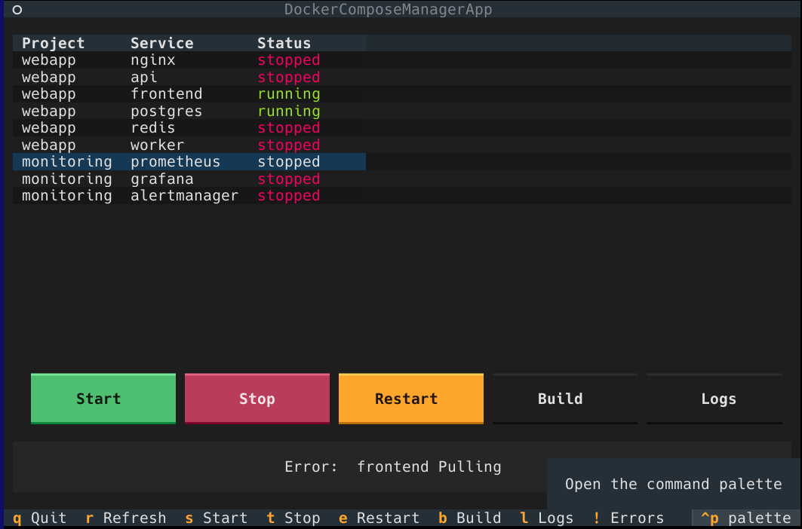

# dcman - Docker Compose Manager

A terminal user interface (TUI) tool for managing multiple Docker Compose projects from a single dashboard.



## Overview

`dcman` scans a directory tree for `docker-compose.yml` files and presents all discovered services in an interactive table. You can start, stop, restart, and build services, as well as view their logs - all from within the terminal.

## Features

- **Auto-discovery**: Recursively finds all `docker-compose.yml` and `docker-compose.yaml` files in a directory
- **Service Management**: Start, stop, and restart individual services
- **Build Support**: Build or rebuild services with real-time streaming output
- **Live Logs**: View container logs with auto-refresh
- **Status Monitoring**: Color-coded status indicators (running, stopped, building, etc.)
- **Keyboard Navigation**: Full keyboard control with intuitive shortcuts

## Requirements

- Python 3.10 or higher
- Docker with Docker Compose v2 (the `docker compose` command)
- [uv](https://github.com/astral-sh/uv) (optional, for running as a script)

## Installation

No installation is required! You can run the script directly with `uv`:

```shell
uv run dcman.py [directory]
```

### Nix

If you use Nix with flakes enabled, you can run `dcman` directly:

```shell
nix run github:andreyfedoseev/dcman
```

Or install it into your profile:

```shell
nix profile install github:andreyfedoseev/dcman
```

## Usage

```shell
# Scan current directory
uv run dcman.py

# Scan a specific directory
uv run dcman.py /path/to/projects
```

## Keyboard Shortcuts

| Key | Action |
| -- | -- |
| `s` | Start selected service |
| `t` | Stop selected service |
| `e` | Restart selected service |
| `b` | Build selected service |
| `l` | View logs for selected service |
| `r` | Refresh all service statuses |
| `!` | Show parsing errors (if any) |
| `Enter` | Toggle service (start/stop) |
| `q` | Quit |

### In Logs View

| Key | Action |
| -- | -- |
| `Esc` / `q` | Close logs |

## Interface

The main screen displays a table with three columns:

- **Project**: The name of the docker-compose project (derived from the directory name)
- **Service**: The service name as defined in the compose file
- **Status**: Current container status with color coding:
  - Green: running
  - Red: stopped
  - Cyan: loading
  - Magenta: building
  - Yellow: other states

## Notes

- The tool excludes `.devcontainer` directories from scanning

## License

MIT License
